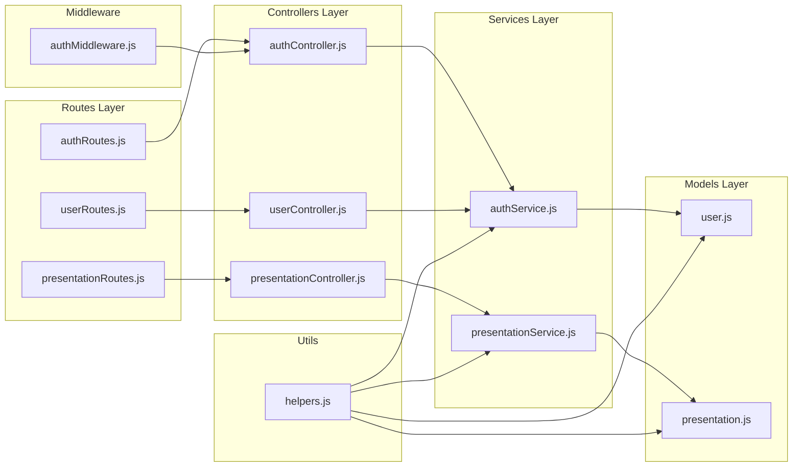

# Architecture Monotlithe

```mermaid
flowchart LR
  %% Définition des couches
  subgraph Routes Layer
    AR[authRoutes.js]
    UR[userRoutes.js]
    PR[presentationRoutes.js]
  end

  subgraph Controllers Layer
    AC[authController.js]
    UC[userController.js]
    PC[presentationController.js]
  end

  subgraph Services Layer
    AS[authService.js]
    PS[presentationService.js]
  end

  subgraph Models Layer
    UM[user.js]
    PM[presentation.js]
  end

  subgraph Middleware
    AM[authMiddleware.js]
  end

  subgraph Utils
    H[helpers.js]
  end

  %% Flèches de routing
  AR --> AC
  UR --> UC
  PR --> PC

  %% Controllers → Services
  AC --> AS
  UC --> AS
  PC --> PS

  %% Services → Models
  AS --> UM
  PS --> PM

  %% Middleware appliquée
  AM --> AC

  %% Utilitaires partagés
  H --> AS
  H --> PS
  H --> UM
  H --> PM
```